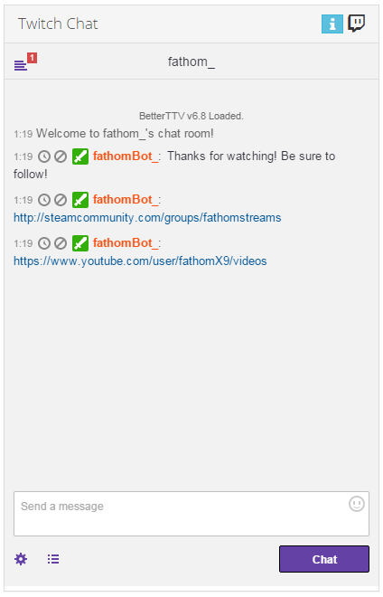

# Twitch Chat for NodeCG

[NodeCG](http://nodecg.com/) bundle which loads Twitch chat as a dashboard panel



## Installation

- Install to `nodecg/bundles/twitch-chat`

## Usage

- Create `nodecg/cfg/twitch-chat.json` and populate with the sample config

### Sample Config

```
{
    "username": "fathom_"
}
```
